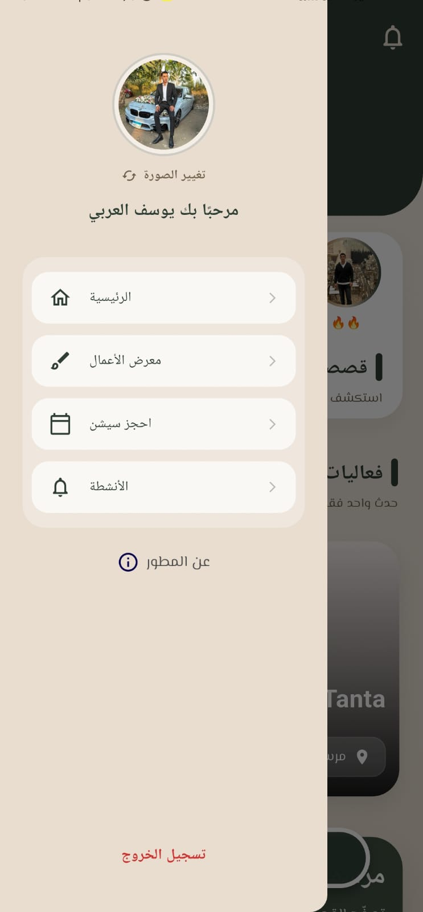
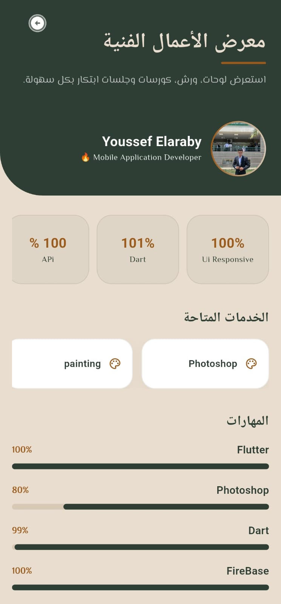
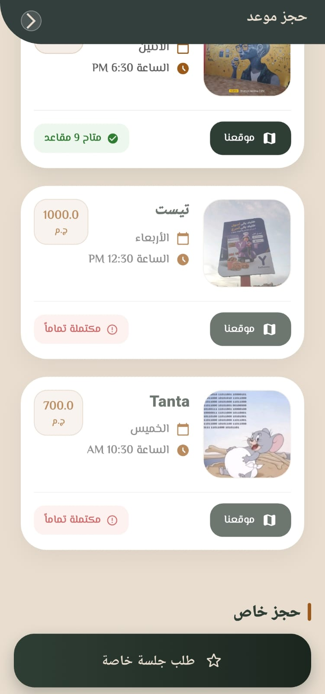
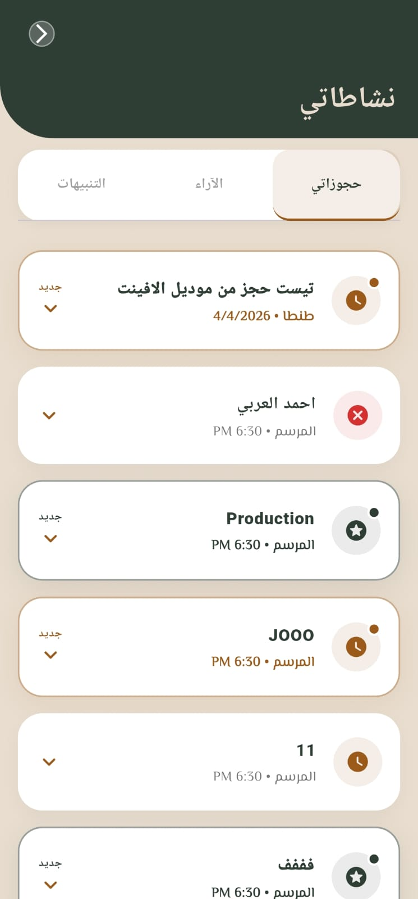
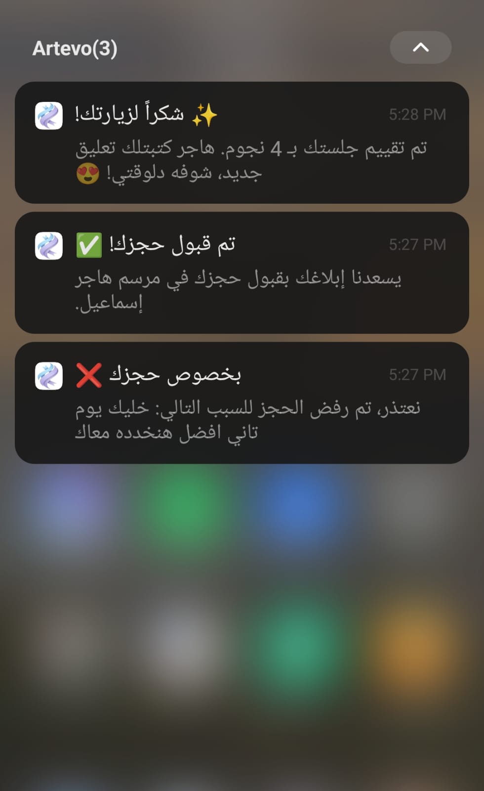
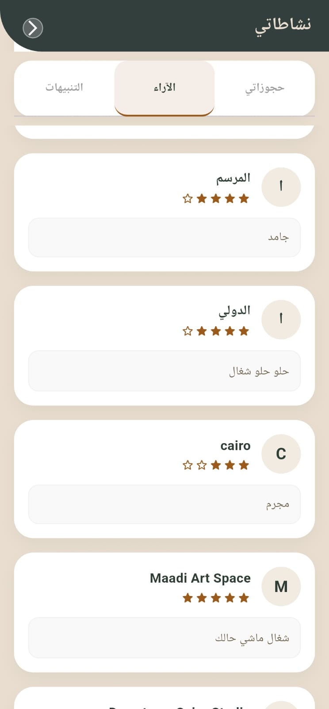

# 🎨 Artevo - Marsem
**A Comprehensive Art Workshop Management System (Mobile App & Web Dashboard)**

"Artevo" is a professional platform designed to bridge the gap between art instructors and trainees, offering a seamless booking experience and a powerful management system.

---

## 📸 Application Showcase

### 🔐 Onboarding & Security
| Sign In | Sign Up | Navigation Drawer |
| :---: | :---: | :---: |
|  |  |  |

### 🏠 Home & Discovery
| Main Home | Workshops Feed | Portfolio |
| :---: | :---: | :---: |
|  |  |  |

### 📅 Booking & Details
| Workshop Details | Booking Process | Booking Confirmed |
| :---: | :---: | :---: |
|  |  |  |

### 🔔 Activities & Notifications
| Activity Stream | Notifications | User Activity |
| :---: | :---: | :---: |
|  |  |  |

---
## 🚀 Key Features

### 📱 User Mobile App
- **Smart Booking System:** Real-time workshop browsing, seat availability tracking, and instant booking.
- **Dynamic Profile Management:** In-app profile picture updates integrated with **Cloudinary**, featuring "Cache Breaking" for instant visual updates.
- **Push Notifications:** Real-time alerts for workshop schedules, booking confirmations, and news via **Firebase Cloud Messaging (FCM)**.
- **Fluid UI/UX:** Responsive design across all screen sizes with smooth animations and artistic aesthetics.

### 💻 Admin Dashboard (Web)
- **Content Management (CRUD):** Fully manage workshops (Create, Read, Update, Delete) with easy data entry.
- **User & Booking Insights:** Monitor subscription counts and track user activity per workshop.
- **Media Management:** Direct integration with **Cloudinary API** for efficient image hosting.

---

## 🛠️ Technical Stack

- **Frontend:** Flutter (Mobile & Web).
- **State Management:** BLoC / Cubit.
- **Backend:** Firebase Suite (Authentication, Firestore, Cloud Messaging).
- **Image Hosting:** Cloudinary API.

---

## 🛡️ Stability & Security
- **Real-time Synchronization:** Utilizes StreamBuilders for instant UI data updates.
- **Robust Error Handling:** Custom error reporting system for a smooth user experience.
- **Branch Protection:** Secure GitHub workflow requiring Pull Requests and reviews before merging to the `main` branch.

---

## 🚀 Getting Started

1. **Clone the repository:**
   ```bash
   git clone [https://github.com/youssefel3raby777/artevo_app.git](https://github.com/youssefel3raby777/artevo_app.git)